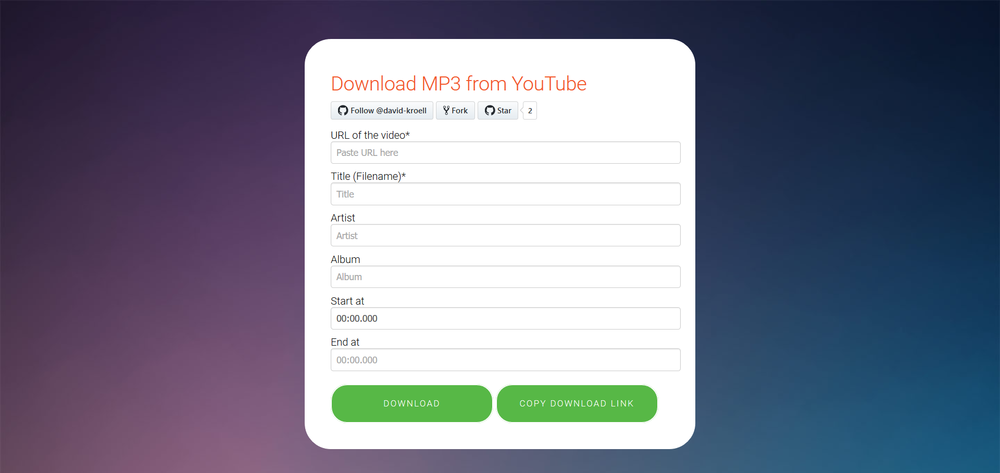

# ytdl 
 
 
 
 



A simple web-based YouTube MP3 downloader

## Installation

### From Dockerhub
The official Docker image is hosted on [Dockerhub](https://hub.docker.com/r/davidkroell/ytdl/).

```bash
 docker run -d -p 3000:3000 \
     --restart=always \
     --name ytdl \
     davidkroell/ytdl:1.3.1
```

#### From source
ytdl can also be built from source. For this, just follow along.

```bash
# get the code and build a Docker image
git clone https://github.com/david-kroell/ytdl
cd ytdl
docker build -t davidkroell/ytdl:fromSource .

# run it
docker run -d -p 3000:3000 davidkroell/ytdl:fromSource
```

##### Behind reverse proxy

If you are behind a reversed proxy, you should make use of the environement variable `PROXY_HEADER_REAL_IP_KEY`. This variable specifies the HTTP header in which the original IP-Address is stored by the proxy. For apache this is normally `X-Forwarded-For`, for [jwilder's automated reverse proxy](https://github.com/jwilder/nginx-proxy) this should be `X-Real-Ip`

```bash
# run behind proxy
docker run -d -p 3000:3000 -e PROXY_HEADER_REAL_IP_KEY=X-Forwarded-For davidkroell/ytdl:fromSource
```

###### Contributing
When contributing to this repository, please first discuss the change you wish to make via issue, email, or any other method with the owners of this repository before making a change.

When you want to make changes to this repository, make sure a `ffmpeg` executable is present in the root directory of the source code. It may also work, if `ffmpeg` is on your path, but it is not tested.

No ffmpeg on your machine? Download it for your OS from [ffmpeg.org](https://www.ffmpeg.org/download.html)

#### Development
There are already three scripts configured in `package.json` to work with.

- `npm run start` runs the app after linter has passed without errors (warnings are OK)
- `npm run lint` runs the linter only
- `npm run lint-fix` tries to fix lint errors automatically. This works if the linter fails on indentation, wrong quotes or something similar

### Opening Pull Requests
Before opening pull request go through this checklist:
- Make sure to test your solution
- Run the linter without any errors

## Disclaimer
The authors are not responsible for any misuse of the software.
